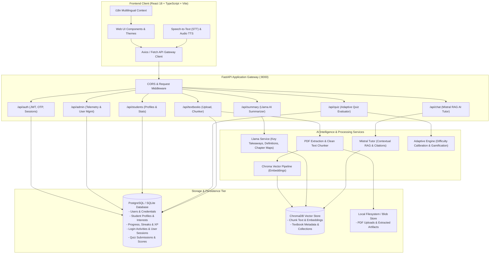
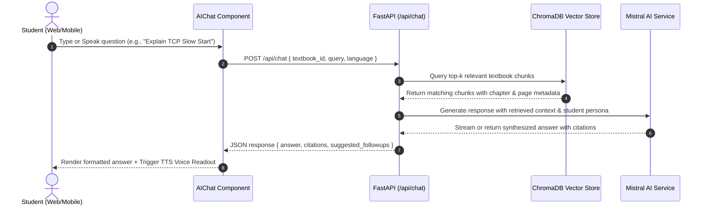
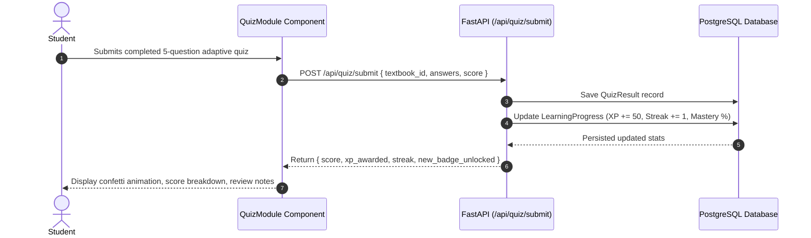

# Architecture Overview – AARVA System

**AARVA** (AI-Based Adaptive Learning and Textbook Summarization System) is a modular, high-performance platform engineered for personalized education across school students, college undergraduates, working professionals, and lifelong learners.

---

## 1. System Architecture Diagram

---

## 2. Key Architectural Layers

### A. Client Layer (Frontend)
- **Framework**: React 18, TypeScript, Vite.
- **State Management & Contexts**:
  - `AuthContext`: Role-based authentication (Student / Admin), JWT token persistence in `localStorage`, and demo account switcher.
  - `ThemeContext`: Dark/Light theme switching, multilingual localization dictionary (English, Hindi, Tamil, Telugu, Spanish, French), and Web Speech API (TTS & STT).
- **Component Hierarchy**:
  - `UniversalSignup.tsx`: 4-stage adaptive enrollment stepper with persona-tailored fields.
  - `StudentPortal.tsx`: Dual-learning screen coordinator toggling between Summarizer, AI Tutor Chat, Adaptive Quiz, and Progress Analytics.
  - `SummarizerView.tsx`: Multi-tier summarization (Complete book, Chapter-wise, Page-wise, Concept-wise) with export options (Markdown & Print).
  - `AIChat.tsx`: Real-time RAG-powered tutor with chapter/page source citations and voice readout.
  - `QuizModule.tsx`: Timed adaptive quiz with instant pedagogical answer breakdown and streak/XP rewards.
  - `AdminPortal.tsx`: Telemetry dashboard, student inspection modal, and account suspension controls.

### B. Gateway & API Layer (FastAPI Backend)
- **FastAPI**: Asynchronous Python ASGI web server providing OpenAPI (Swagger) documentation and typed Pydantic validation.
- **Security & Session Management**:
  - Passwords hashed using `bcrypt`.
  - Stateless JSON Web Tokens (`HS256`) paired with database-backed `user_sessions` tracking for active session revocation.
  - Email verification codes generated and verified via `services/email_service.py`.

### C. AI Intelligence & Vector Search (RAG)
- **Textbook Ingestion**: `pypdf` / `pdfplumber` extracts structured text from uploaded PDF textbooks.
- **Vector Storage (`ChromaDB`)**: Extracted text chunks are indexed with dense embeddings for high-speed semantic similarity retrieval.
- **Llama Summarization Service**: Generates chapter summaries, key takeaways, and glossary definitions tailored to the learner's persona.
- **Mistral AI Tutor Chat**: Retrieves relevant chunks from ChromaDB based on student questions, injecting textbook context and citing exact chapter and page sources.

---

## 3. End-to-End Workflow Diagrams

### RAG AI Tutor Chat Pipeline

### Adaptive Quiz Submission & XP Evaluation

