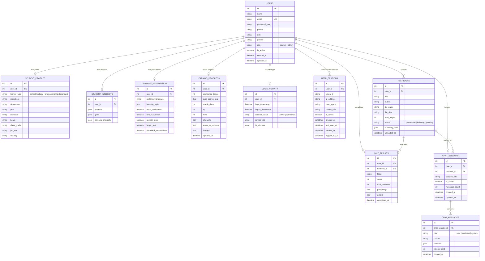

# Database Schema Documentation – AARVA

AARVA utilizes **PostgreSQL** (with local **SQLite** fallback) as its core relational data store. The database schema is managed via **SQLAlchemy ORM** in `backend/models/models.py`.

---

## 1. Entity-Relationship (ER) Diagram

---

## 2. Table Specifications

### 1. `users`
Core user identity and authentication credentials.
- `id` (Integer, Primary Key, Auto-increment)
- `name` (String(120), Nullable=False)
- `email` (String(255), Unique=True, Index=True, Nullable=False)
- `password_hash` (String(255), Nullable=False) – Bcrypt hashed password
- `phone` (String(30), Nullable=True)
- `dob` (String(20), Nullable=True)
- `gender` (String(20), Nullable=True)
- `role` (String(20), Default='student') – Either `'student'` or `'admin'`
- `is_active` (Boolean, Default=True) – Account suspension flag
- `created_at` (DateTime, Default=UTC now)
- `updated_at` (DateTime, Default=UTC now)

### 2. `student_profiles`
Persona metadata customized for school, college, professional, or independent learners.
- `user_id` (Integer, Foreign Key to `users.id`, Unique=True)
- `learner_type` (String(50)) – `'school'`, `'college'`, `'professional'`, `'independent'`
- `institution`, `department`, `year`, `semester` – For college undergraduates
- `board`, `class_grade` – For school students (e.g. CBSE Class 11)
- `job_role`, `industry` – For working professionals

### 3. `student_interests` & `learning_preferences`
- JSON-encoded arrays of subjects, goals, personal passions.
- Accessibility & UI preferences including preferred language, speech TTS, STT voice input, and larger font settings.

### 4. `learning_progress` & `quiz_results`
- Tracks gamification metrics (XP points, current level, active day streaks).
- Records topic-by-topic strengths and areas needing review.
- Persists full quiz answer submissions with percentage scores.

### 5. `textbooks` & Vector Indexing
- Stores uploaded document references, file sizes, total page counts, and pre-computed hierarchical summaries (complete overview, chapter summaries, key takeaways, glossary terms).

### 6. `user_sessions`, `chat_sessions`, `chat_messages`
- Full tracking of active JWT sessions for security compliance.
- Threaded conversation histories with RAG citations for the Mistral AI tutor.
