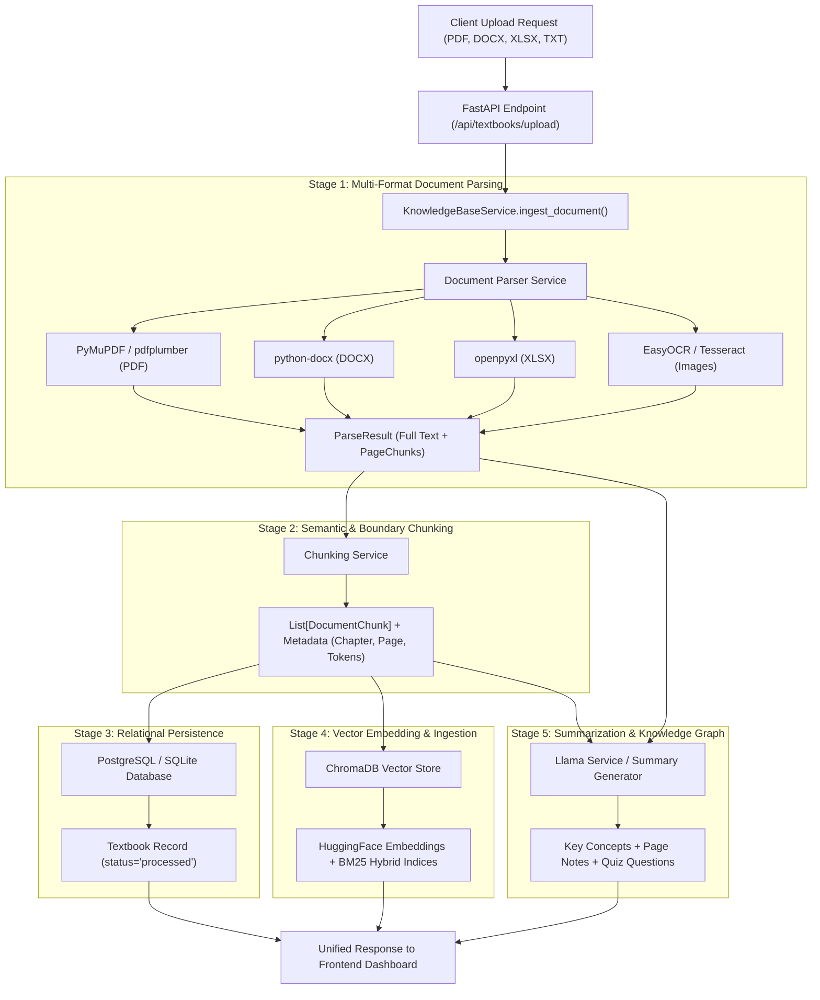

# Aarva Ingestion & Document Processing Pattern (Architecture & Design Specification)

This document specifies the end-to-end **Document Processing Pattern** implemented in the **Aarva Academic Intelligence System**. It details the multi-stage pipeline responsible for document parsing, semantic chunking, relational state tracking, vector store indexing, and LLM-driven knowledge summarization.

---

## 1. System Overview & Pattern Architecture

The processing pipeline follows a **Modular Chain-of-Responsibility & Pipeline Pattern**. Incoming document uploads pass through discrete, isolated processing stages. Each stage transforms raw file data into enriched contextual metadata, ensuring high-fidelity retrieval-augmented generation (RAG) for academic learning.



---

## 2. Step-by-Step Processing Stages

### Stage 1: Multi-Format Document Parsing (`services/document_parser.py`)
- **Responsibility**: Extract clean text, structure, page boundaries, and section headings from uploaded media.
- **Engine Handlers**:
  - **PDF (`.pdf`)**: Primary extraction via **PyMuPDF (`fitz`)** for ultra-fast text and font analysis. Fallback to **`pdfplumber`** for multi-column documents and tables.
  - **Word (`.docx`, `.doc`)**: Extracted using `python-docx` for paragraphs and tables; `mammoth` for legacy formatting.
  - **Excel (`.xlsx`, `.xls`)**: Parsed using `openpyxl` sheet-by-sheet into tabular Markdown format.
  - **Text (`.txt`, `.md`, `.csv`)**: Automatic character encoding detection via `chardet`.
  - **Images (`.png`, `.jpg`, `.webp`)**: OCR fallback using `EasyOCR` or `pytesseract`.
- **Output Data Unit**: `ParseResult` dataclass containing `full_text`, `pages` (`List[PageChunk]`), `page_count`, and `parse_warnings`.

### Stage 2: Contextual & Boundary-Aware Chunking (`services/chunking_service.py`)
- **Responsibility**: Convert long-form text into overlapping chunks designed for dense vector search and hybrid retrieval.
- **Chunk Parameters**:
  - Target size: ~500–800 tokens per chunk.
  - Overlap: 100 tokens to preserve edge context across boundaries.
- **Metadata Enriched**:
  - `document_id`, `chapter`, `page_number`, `token_count`, `keywords`.

### Stage 3: Relational Database Persistence (`backend/models/models.py`)
- **Responsibility**: Track user library state and document availability.
- **Transaction Flow**:
  - Inserts a new `Textbook` row linked to `user_id`.
  - Stores filename, total page count, upload timestamp, file size, and processing status.
  - On pipeline error, rolls back DB changes cleanly.

### Stage 4: Vector Indexing & Hybrid Search (`database/chroma.py`)
- **Responsibility**: Enable semantic similarity search and keyword lookup.
- **Vector Operations**:
  - Generates dense vector embeddings using local transformer embeddings (`all-MiniLM-L6-v2` or Ollama embeddings).
  - Upserts chunks into ChromaDB collection keyed by `textbook_id`.
  - Prepares keyword tokens for reciprocal rank fusion (RRF) hybrid search.

### Stage 5: Knowledge Summarization & Concept Extraction (`services/llama_service.py`)
- **Responsibility**: Seed initial learning workspace options for interactive study.
- **Generated Assets**:
  - **Executive Summary**: 1–2 sentence essence of the document.
  - **Page-Wise Insights**: Page range summaries (e.g., Pages 01–28).
  - **Concept Path**: Key academic concepts mapped for interactive 50-question quizzes.
  - **Definitions & Formulas**: Key terms automatically harvested for revision cards.

---

## 3. Data Schemas & Contracts

### `ParseResult` Schema
```json
{
  "full_text": "Extracted text content...",
  "pages": [
    {
      "page_number": 1,
      "text": "Chapter 1: Neural Networks introduction...",
      "chapter": "Chapter 1: Principles of Machine Learning",
      "word_count": 340
    }
  ],
  "page_count": 42,
  "file_type": "pdf",
  "word_count": 14280,
  "parse_warnings": []
}
```

### `DocumentChunk` Schema
```json
{
  "chunk_id": "doc_12_chunk_004",
  "textbook_id": 12,
  "chunk_index": 4,
  "text": "A neural network consists of layers of interconnected nodes...",
  "page_number": 3,
  "chapter": "Chapter 1: Principles of Machine Learning",
  "token_count": 185
}
```

---

## 4. Error Handling & Resiliency Rules

1. **Non-Blocking Parsing**: OCR failures or missing font tables issue non-fatal warnings into `parse_warnings` without failing the overall upload.
2. **Empty Content Guard**: Documents with fewer than 20 clean characters trigger an explicit `HTTP 400 Bad Request` with actionable user feedback.
3. **Cascading Deletion**: Deleting a textbook removes relational DB entries and purges corresponding vector collections in ChromaDB.
